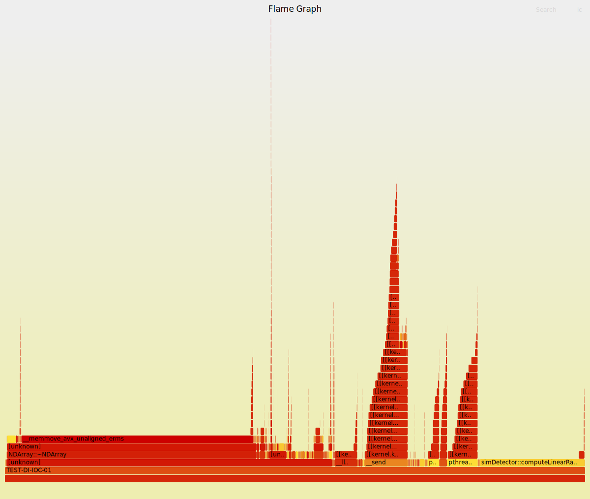

# areaDetector collaboration meeting

## Collaboration
- Would [Github stale bot](https://github.com/actions/stale) be interesting? It marks/comments an issue/PR as stale after 60 days of inactivity and closes it after 14 more days of inactivity, will do after this meeting. Investigate if it can be selective about issues.
- Initial profiling of a generic AD pipeline: SimDetector+PROC+ROI+TR
    - Frame rate around 194hz (period set to .005), frame size 1280x960
    - Perf+FlameGraph result: 
    This seems to indicate a lot of time spent memcopying inside the NDArray destructor, I will investigate further. I intend to profile a more realistic pipeline, e.g. 2MB frame at 560hz or something that could saturate a 40Gb/s link
    I will add enough information in the collaboration repo to reproduce the test (see [here](2024-07-04/))
    Investigate how to add more debug symbols.
- Improve autogenerated list of issues and PRs, to avoid long lists, we will filter last fetched and include ones modified recently

## Issues and PRs (<=30days filtered)
- ADAravis:
    - Issues:
        - [ ] [Build failure on Ubuntu 22.04](https://github.com/areaDetector/ADAravis/issues/28)
- ffmpegServer:
    - Issues:
        - [ ] [ffmpeg 5 compatibility](https://github.com/areaDetector/ffmpegServer/issues/36)

## Issues and PRs
- areaDetector:
    - Issues:
        - [ ] [Type in configure/EXAMPLE_RELEASE.local](https://github.com/areaDetector/areaDetector/issues/88)
        - [ ] [ADEiger not listed in Supported Detectors](https://github.com/areaDetector/areaDetector/issues/86)
        - [ ] [WITH_PVA = YES ignored if there is a space after "YES"?](https://github.com/areaDetector/areaDetector/issues/85)
        - [ ] [Missing BUILD_IOCS conditional in submodule top-level Makefile rules](https://github.com/areaDetector/areaDetector/issues/80)
        - [ ] [Documentation work needed](https://github.com/areaDetector/areaDetector/issues/74)
        - [ ] [Addition of ADPluginCentroids to areaDetector ](https://github.com/areaDetector/areaDetector/issues/70)
        - [ ] [tags for R1-x series](https://github.com/areaDetector/areaDetector/issues/25)
    - PRs:
        - [ ] [Add script for generating release notes automatically](https://github.com/areaDetector/areaDetector/pull/91)
        - [ ] [Enhance R3-13 release notes](https://github.com/areaDetector/areaDetector/pull/89)
        - [ ] [Simplify build configuration](https://github.com/areaDetector/areaDetector/pull/72)
        - [ ] [Added ADPluginCentroids](https://github.com/areaDetector/areaDetector/pull/69)
- ADCore:
    - Issues:
        - [ ] [Remove `documentation` directory?](https://github.com/areaDetector/ADCore/issues/506)
        - [ ] [Github Actions failing due to asyn](https://github.com/areaDetector/ADCore/issues/495)
        - [ ] [PVAttribute with higher or configurable priority](https://github.com/areaDetector/ADCore/issues/491)
        - [ ] [Stopping streaming on file plugins discards all arrays in queue](https://github.com/areaDetector/ADCore/issues/469)
        - [ ] [Suggestion: New PV for identifying unit of measurement for 'Time' PVs](https://github.com/areaDetector/ADCore/issues/463)
        - [ ] [ADBase.template equivalent for 1D detectors](https://github.com/areaDetector/ADCore/issues/409)
        - [ ] [Allow HDF5 plugin to append new NDArrays to existing HDF5 archive](https://github.com/areaDetector/ADCore/issues/403)
        - [ ] [Risk of memory leak if branch is taken?](https://github.com/areaDetector/ADCore/issues/393)
        - [ ] [$(RTS) macro not provided to NDFFT.adl](https://github.com/areaDetector/ADCore/issues/364)
        - [ ] [Hardcoded ":" in request file](https://github.com/areaDetector/ADCore/issues/343)
        - [ ] [HDF5 Blosc compressor is not documented](https://github.com/areaDetector/ADCore/issues/339)
        - [ ] [Support drvInfo for NDArray callbacks](https://github.com/areaDetector/ADCore/issues/334)
        - [ ] [Not all example IOCs use P macro value starting with same prefix](https://github.com/areaDetector/ADCore/issues/326)
        - [ ] [Remove obsolete edl files](https://github.com/areaDetector/ADCore/issues/310)
        - [ ] [Indicate error in OPI if error  creating  an NDAttribute](https://github.com/areaDetector/ADCore/issues/306)
        - [ ] [Add screen shot of new caQtDM viewer screen to areaDetectorDoc.html](https://github.com/areaDetector/ADCore/issues/303)
        - [ ] [PVStructure::getSubField() can return NULL](https://github.com/areaDetector/ADCore/issues/296)
        - [ ] [support caQtDM caCamera widget with a .ui screen](https://github.com/areaDetector/ADCore/issues/294)
        - [ ] [ioc crash due to arithmetic error in HDF5 plugin](https://github.com/areaDetector/ADCore/issues/287)
        - [ ] [Add caching on Travis to speed up build](https://github.com/areaDetector/ADCore/issues/273)
        - [ ] [NDFileNexus problem](https://github.com/areaDetector/ADCore/issues/264)
        - [ ] [Add flag to prevent overwriting files in NDPluginFile](https://github.com/areaDetector/ADCore/issues/255)
        - [ ] [Move more functionality into the ADDriver base class](https://github.com/areaDetector/ADCore/issues/251)
        - [ ] [Create mixer plugin](https://github.com/areaDetector/ADCore/issues/236)
        - [ ] [ASCII file saving plugin](https://github.com/areaDetector/ADCore/issues/182)
        - [ ] [New OPI to show pixel data in CSS intensity graph](https://github.com/areaDetector/ADCore/issues/180)
        - [ ] [Create unittest for NDPluginDriver](https://github.com/areaDetector/ADCore/issues/169)
        - [ ] [option to not write NDAttr* attributes in HDF5 dataset](https://github.com/areaDetector/ADCore/issues/145)
        - [ ] [Expand CI services to cover more configurations](https://github.com/areaDetector/ADCore/issues/115)
        - [ ] [Find a way to stop misbehaving plugins from slowing down driver](https://github.com/areaDetector/ADCore/issues/98)
    - PRs:
        - [ ] [Remove erroneous variable type information.](https://github.com/areaDetector/ADCore/pull/505)
        - [ ] [Update URL of legacy pre-built artifacts and NTNDArray specification](https://github.com/areaDetector/ADCore/pull/504)
        - [ ] [adding video compression (h264)](https://github.com/areaDetector/ADCore/pull/499)
        - [ ] [Switch from pvDatabase to SharedPV](https://github.com/areaDetector/ADCore/pull/485)
        - [ ] [Create AWS S3 Interface for TIFF Files](https://github.com/areaDetector/ADCore/pull/458)
        - [ ] [Slac edl](https://github.com/areaDetector/ADCore/pull/316)
        - [ ] [Applied bitsPerPixel.patch to bring in bitsPerPixel support from pcds…](https://github.com/areaDetector/ADCore/pull/314)
- ADEiger:
    - Issues:
        - [ ] [Stream mode with CompressionAlgo=None and Decompress=No gives "unknown encoding <"](https://github.com/areaDetector/ADEiger/issues/64)
        - [ ] [Data Files Transferred to Wrong Directory](https://github.com/areaDetector/ADEiger/issues/61)
        - [ ] [IOC Console errors and trouble applying settings with Eiger2 500K](https://github.com/areaDetector/ADEiger/issues/57)
        - [ ] [Wrong Energy and Wavelength in metadata after initialize](https://github.com/areaDetector/ADEiger/issues/53)
        - [ ] [Data values in Pump&Probe mode seem wrong](https://github.com/areaDetector/ADEiger/issues/44)
        - [ ] [Data values in HDR mode seem wrong](https://github.com/areaDetector/ADEiger/issues/43)
        - [ ] [Pump & Probe mode crashes FileWriter](https://github.com/areaDetector/ADEiger/issues/42)
        - [ ] [Setting photon_energy on Eiger2 returns null](https://github.com/areaDetector/ADEiger/issues/41)
        - [ ] [Problem interrupting a scan](https://github.com/areaDetector/ADEiger/issues/39)
        - [ ] [Setting values that change bit depth image take a long time to return](https://github.com/areaDetector/ADEiger/issues/34)
        - [ ] [FileWrite stopped working](https://github.com/areaDetector/ADEiger/issues/18)
        - [ ] [Request - Alarm when local storage running out](https://github.com/areaDetector/ADEiger/issues/12)
- ADAravis:
    - Issues:
        - [ ] [Build failure on Ubuntu 22.04](https://github.com/areaDetector/ADAravis/issues/28)
        - [ ] [Best way to automatically re-initialize power cycled cameras?](https://github.com/areaDetector/ADAravis/issues/21)
        - [ ] [0 size buffers in processBuffer() when capturing 'Single' or 'Multiple'](https://github.com/areaDetector/ADAravis/issues/20)
        - [ ] [Incorrect dataTimeStamp](https://github.com/areaDetector/ADAravis/issues/17)
    - PRs:
        - [ ] [WIP: Try to automatically reconnect when connection is lost](https://github.com/areaDetector/ADAravis/pull/27)
        - [ ] [Aravis fixes](https://github.com/areaDetector/ADAravis/pull/26)
        - [ ] [Re-ordered includes in the main configure/RELEASE](https://github.com/areaDetector/ADAravis/pull/24)
- ADGenICam:
    - Issues:
        - [ ] [Add PVs for minimum and maximum for GenICam int64 and double features](https://github.com/areaDetector/ADGenICam/issues/30)
        - [ ] [Exposure Time is not controllable with a Basler Camera](https://github.com/areaDetector/ADGenICam/issues/27)
    - PRs:
        - [ ] [Acquisition mode fallback](https://github.com/areaDetector/ADGenICam/pull/33)
- ADSpinnaker:
    - Issues:
        - [ ] [ADSpinnaker vs ADAravis](https://github.com/areaDetector/ADSpinnaker/issues/10)
        - [ ] [MEDM not responsive after acquiring image in "continuous" mode and Mono12Packed Pixel format](https://github.com/areaDetector/ADSpinnaker/issues/4)
        - [ ] [Linux IOCs is failing after some days when running USB camera at 163 frames/s](https://github.com/areaDetector/ADSpinnaker/issues/1)
- ADVimba:
    - Issues:
        - [ ] [Simultaneous acquisition from multiple cameras does not work](https://github.com/areaDetector/ADVimba/issues/8)
        - [ ] [Improve connection management](https://github.com/areaDetector/ADVimba/issues/7)
        - [ ] [Circular dependency.](https://github.com/areaDetector/ADVimba/issues/1)
- ADAndor3:
    - Issues:
        - [ ] [EPICS can't find Zyla 5.5 camera](https://github.com/areaDetector/ADAndor3/issues/15)
        - [ ] [Image timestamp EPOCH is different from ADAndor driver](https://github.com/areaDetector/ADAndor3/issues/6)
- ADAndor:
    - Issues:
        - [ ] [TemperatureActual only updates when not acquiring](https://github.com/areaDetector/ADAndor/issues/56)
        - [ ] [ADAcquireBusy goes to 0 before camera is really done](https://github.com/areaDetector/ADAndor/issues/54)
        - [ ] [andorCCD:dataTask:, Data thread is running but main thread thinks we are not acquiring.](https://github.com/areaDetector/ADAndor/issues/51)
        - [ ] [ Only call SetVSAmplitude if the camera supports it.](https://github.com/areaDetector/ADAndor/issues/49)
        - [ ] [No LICENSE information](https://github.com/areaDetector/ADAndor/issues/43)
        - [ ] [HDF plugin saves frame with fill value in single capture mode with SWMR mode on](https://github.com/areaDetector/ADAndor/issues/41)
        - [ ] [ADAndor: Document time units](https://github.com/areaDetector/ADAndor/issues/29)
        - [ ] [Incorrect number of parameters](https://github.com/areaDetector/ADAndor/issues/23)
        - [ ] [How can achieve <1ms Average Read Out Speed?](https://github.com/areaDetector/ADAndor/issues/16)
    - PRs:
        - [ ] [Remove obsolete shamrockDummy.cpp to avoid confusion](https://github.com/areaDetector/ADAndor/pull/57)
- ADSimDetector:
    - Issues:
        - [ ] [Doesn't compile on Debian 10 (x86_64) with GCC 8.3.0 and OpenCV 4.5.2](https://github.com/areaDetector/ADSimDetector/issues/19)
        - [ ] [simDetectorNoIOC.cpp incorrectly declares  class epicsShareClass simDetectorDemo](https://github.com/areaDetector/ADSimDetector/issues/15)
- specsAnalyser:
    - Issues:
        - [ ] [readback in 'Fixed Energy' mode requires cam1:datatype to be float64](https://github.com/areaDetector/specsAnalyser/issues/5)
        - [ ] [Fix reply for Ordinate Axis](https://github.com/areaDetector/specsAnalyser/issues/4)
        - [ ] [Fix EOT in specsAnalyser](https://github.com/areaDetector/specsAnalyser/issues/2)
    - PRs:
        - [ ] [Bug fix NDArrayPool and New make parameter db file](https://github.com/areaDetector/specsAnalyser/pull/7)
- ADPylon:
    - Issues:
        - [ ] [IOC receives camera connection failed occasionally](https://github.com/areaDetector/ADPylon/issues/4)
        - [ ] [IOC stops collecting images from the camera](https://github.com/areaDetector/ADPylon/issues/2)
    - PRs:
        - [ ] [Fix linker error linux](https://github.com/areaDetector/ADPylon/pull/5)
- pvaDriver:
    - Issues:
        - [ ] [Poor performance with default request type queue size](https://github.com/areaDetector/pvaDriver/issues/12)
    - PRs:
        - [ ] [In the pvaDriverConfig function, make it possible to use a non-defaul…](https://github.com/areaDetector/pvaDriver/pull/13)
        - [ ] [Typo in README](https://github.com/areaDetector/pvaDriver/pull/11)
- ADPvCam:
    - Issues:
        - [ ] [support for windows-x64](https://github.com/areaDetector/ADPvCam/issues/6)
- ADSupport:
    - Issues:
        - [ ] [Can't build using MingW on Linux.](https://github.com/areaDetector/ADSupport/issues/38)
        - [ ] [Blosc compression in HDF5 is not designed for multiple threads call blosc library?](https://github.com/areaDetector/ADSupport/issues/24)
        - [ ] [ADSupport does not generate correct static mingw libs for GraphicsMagick](https://github.com/areaDetector/ADSupport/issues/18)
        - [ ] [Bug in nexusSrc (or NDFileNexus in ADCore)](https://github.com/areaDetector/ADSupport/issues/9)
        - [ ] [Cannot define H5_HAVE_THREADSAFE on mingw](https://github.com/areaDetector/ADSupport/issues/6)
        - [ ] [TIME datatypes won't compile on vxWorks](https://github.com/areaDetector/ADSupport/issues/5)
    - PRs:
        - [ ] [adding video compression (h264)](https://github.com/areaDetector/ADSupport/pull/44)
        - [ ] [Build module with MingW (and other compilers) with Ubuntu host on our GitLab server.](https://github.com/areaDetector/ADSupport/pull/39)
- ADUVC:
    - Issues:
        - [ ] [Improve Handling of IOC startup and operating modes](https://github.com/areaDetector/ADUVC/issues/38)
        - [ ] [Add iocsh function to set the zoom ratio](https://github.com/areaDetector/ADUVC/issues/37)
- ADLambda:
    - Issues:
        - [ ] [Error loading config files](https://github.com/areaDetector/ADLambda/issues/7)
        - [ ] [Infrequent hang of the IOC](https://github.com/areaDetector/ADLambda/issues/6)
    - PRs:
        - [ ] [base frame timestamp off epicsTS](https://github.com/areaDetector/ADLambda/pull/11)
- ADProsilica:
    - Issues:
        - [ ] [ADProsilica-R2-4 release:  Makefile issue?](https://github.com/areaDetector/ADProsilica/issues/22)
        - [ ] [Driver gets stuck when it receives bad frames](https://github.com/areaDetector/ADProsilica/issues/18)
    - PRs:
        - [ ] [Added driver support for NDBitsPerPixel and NDBytesPerPixel parameters](https://github.com/areaDetector/ADProsilica/pull/8)
        - [ ] [Added new prosilica resend params and rates for packet counts](https://github.com/areaDetector/ADProsilica/pull/7)
        - [ ] [Added redef of Gain in prosilica.template so we can set driver limits](https://github.com/areaDetector/ADProsilica/pull/5)
        - [ ] [prosilica.cpp:](https://github.com/areaDetector/ADProsilica/pull/4)
- ADPluginBar:
    - Issues:
        - [ ] [Add support for maxThreads>1](https://github.com/areaDetector/ADPluginBar/issues/29)
        - [ ] [Should not be creating attribute DataType and should not be calling doCallbacksGenericPointer directly](https://github.com/areaDetector/ADPluginBar/issues/28)
        - [ ] [Allow for saving images when barcode is detected](https://github.com/areaDetector/ADPluginBar/issues/10)
    - PRs:
        - [ ] [Removing doCallbacksGeneric pointer, adding maxThreads support ](https://github.com/areaDetector/ADPluginBar/pull/30)
- ffmpegServer:
    - Issues:
        - [ ] [ffmpeg 5 compatibility](https://github.com/areaDetector/ffmpegServer/issues/36)
        - [ ] [HTTP server](https://github.com/areaDetector/ffmpegServer/issues/33)
        - [ ] [Won't build on Linux](https://github.com/areaDetector/ffmpegServer/issues/32)
        - [ ] [Can not download Windows ffmpeg shared libs with install.sh](https://github.com/areaDetector/ffmpegServer/issues/27)
        - [ ] [Liblzma not linking?](https://github.com/areaDetector/ffmpegServer/issues/24)
        - [ ] [install.sh patches FFmpeg sources, but install instructions don't include this](https://github.com/areaDetector/ffmpegServer/issues/22)
    - PRs:
        - [ ] [Use microHTTPd instead of nullhttpd](https://github.com/areaDetector/ffmpegServer/pull/34)
        - [ ] [fixed some record descriptions](https://github.com/areaDetector/ffmpegServer/pull/26)
- ADCompVision:
    - Issues:
        - [ ] [CUDA](https://github.com/areaDetector/ADCompVision/issues/39)
        - [ ] [Include OpenCV build as part of EPICS build?](https://github.com/areaDetector/ADCompVision/issues/38)
- ADViewers:
    - Issues:
        - [ ] [NTNDArray Blosc compression byte order](https://github.com/areaDetector/ADViewers/issues/6)
    - PRs:
        - [ ] [adding video compression support (h264)](https://github.com/areaDetector/ADViewers/pull/25)
        - [ ] [Live Fitting Plugin with userCalc functionality](https://github.com/areaDetector/ADViewers/pull/23)
        - [ ] [Adds log checkbox to GUI](https://github.com/areaDetector/ADViewers/pull/22)
        - [ ] [Image j macros](https://github.com/areaDetector/ADViewers/pull/21)
- ADQImaging:
    - PRs:
        - [ ] [Base frame timestamp off epicsTS](https://github.com/areaDetector/ADQImaging/pull/6)
- ADPICam:
    - Issues:
        - [ ] [Acquire time is in milliseconds](https://github.com/areaDetector/ADPICam/issues/23)
        - [ ] [Camera MTE3 sensor temperature read back value does not update until "Acquire" start.](https://github.com/areaDetector/ADPICam/issues/22)
        - [ ] [No LICENSE file](https://github.com/areaDetector/ADPICam/issues/13)
        - [ ] [ADPICam RELEASE.md appears to be out of date](https://github.com/areaDetector/ADPICam/issues/4)
    - PRs:
        - [ ] [base frame timestamp off epicsTS when not using driver timestamps](https://github.com/areaDetector/ADPICam/pull/24)
        - [ ] [Add specialization for std::hash for PicamParameter to build on older…](https://github.com/areaDetector/ADPICam/pull/19)
        - [ ] [WIP: Multitrack and Improvements](https://github.com/areaDetector/ADPICam/pull/15)
        - [ ] [CCD multi-track capability for Princeton cameras](https://github.com/areaDetector/ADPICam/pull/6)
- ADCSimDetector:
    - PRs:
        - [ ] [base frame timestamp off epicsTS](https://github.com/areaDetector/ADCSimDetector/pull/5)
        - [ ] [support for 64-bit data types](https://github.com/areaDetector/ADCSimDetector/pull/4)
- NDDriverStdArrays:
    - Issues:
        - [ ] [NDPosPlugin.dbd Not Found During Build](https://github.com/areaDetector/NDDriverStdArrays/issues/1)
    - PRs:
        - [ ] [base frame timestamp off epicsTS](https://github.com/areaDetector/NDDriverStdArrays/pull/10)
- ADSBIG:
    - PRs:
        - [ ] [base frame timestamp off epicsTS](https://github.com/areaDetector/ADSBIG/pull/1)
- ADPSL:
    - PRs:
        - [ ] [base frame timestamp off epicsTS](https://github.com/areaDetector/ADPSL/pull/3)
- ADSBIG:
    - PRs:
        - [ ] [base frame timestamp off epicsTS](https://github.com/areaDetector/ADSBIG/pull/1)
- ADPerkinElmer:
    - Issues:
        - [ ] [Problem with rapidly stopping, setting AcquireTime, and starting detector](https://github.com/areaDetector/ADPerkinElmer/issues/4)
    - PRs:
        - [ ] [base frame timestamp off epicsTS](https://github.com/areaDetector/ADPerkinElmer/pull/6)
        - [ ] [Gain file loading and saving using consistent with vendor header format](https://github.com/areaDetector/ADPerkinElmer/pull/5)
- ADLightField:
    - Issues:
        - [ ] [Building](https://github.com/areaDetector/ADLightField/issues/4)
    - PRs:
        - [ ] [base frame timestamp off epicsTS](https://github.com/areaDetector/ADLightField/pull/7)
        - [ ] [Add setlocal, update PATH with LIGHTFIELD_ROOT](https://github.com/areaDetector/ADLightField/pull/6)
- ADFireWireWin:
    - PRs:
        - [ ] [base frame timestamp off epicsTS](https://github.com/areaDetector/ADFireWireWin/pull/3)
- ADDexela:
    - Issues:
        - [ ] [The trigger mode selection should be sent to the device immediately when changed](https://github.com/areaDetector/ADDexela/issues/5)
    - PRs:
        - [ ] [base frame time stamp on epicsTS](https://github.com/areaDetector/ADDexela/pull/7)
- ADPilatus:
    - Issues:
        - [ ] [does this IOC support HDF5 file write?](https://github.com/areaDetector/ADPilatus/issues/20)
        - [ ] [Temperature and humidity update for channel 3 updates channel 0](https://github.com/areaDetector/ADPilatus/issues/19)
        - [ ] [Add remaining time PV](https://github.com/areaDetector/ADPilatus/issues/7)
    - PRs:
        - [ ] [Update timestamp from epics inside while(acquire) loop](https://github.com/areaDetector/ADPilatus/pull/18)
        - [ ] [Check for 7 OK message when waiting for an image to actualy end the acquisition](https://github.com/areaDetector/ADPilatus/pull/17)
- ADMythen:
    - Issues:
        - [ ] [documentation](https://github.com/areaDetector/ADMythen/issues/2)
    - PRs:
        - [ ] [Updates/fixes to the driver, works at NSLS2](https://github.com/areaDetector/ADMythen/pull/5)
        - [ ] [Diamond changes](https://github.com/areaDetector/ADMythen/pull/4)
- ADURL:
    - PRs:
        - [ ] [Build ADURL with ci-scripts on Ubuntu using out GitLab server.](https://github.com/areaDetector/ADURL/pull/9)
- ADmarCCD:
    - Issues:
        - [ ] [Rotation Axis and Start Angle behaviour is inconsistent](https://github.com/areaDetector/ADmarCCD/issues/4)
- ADPointGrey:
    - Issues:
        - [ ] [Automatic way to determine Visual Studio version and hence required library](https://github.com/areaDetector/ADPointGrey/issues/6)
- ADFastCCD:
    - Issues:
        - [ ] [Image array size doesn't match image1:ArraySize0 * image1:ArraySize1](https://github.com/areaDetector/ADFastCCD/issues/13)
        - [ ] [Discuss how to configure "boot" camera from epics IOC](https://github.com/areaDetector/ADFastCCD/issues/9)
        - [ ] [ADFastCCD lacks a RELEASE.md and a documentation directory](https://github.com/areaDetector/ADFastCCD/issues/4)
- ADPcoWin:
    - Issues:
        - [ ] [Linux support?](https://github.com/areaDetector/ADPcoWin/issues/24)
        - [ ] [Help with this Phoebus display](https://github.com/areaDetector/ADPcoWin/issues/23)
        - [ ] [Linking error on Windows Server 2012](https://github.com/areaDetector/ADPcoWin/issues/18)
        - [ ] [CSS .opi screens are missing](https://github.com/areaDetector/ADPcoWin/issues/14)
        - [ ] [cam1:Gain can not be set, as well as cam1:ReverseX and cam1:ReverseY](https://github.com/areaDetector/ADPcoWin/issues/12)
- ADPhotron:
    - Issues:
        - [ ] [Allow use of the 2nd ethernet port of the SA-Z for data transfer](https://github.com/areaDetector/ADPhotron/issues/7)
        - [ ] [MEDM slider behaves badly on some Windows systems](https://github.com/areaDetector/ADPhotron/issues/6)
        - [ ] [report() should use fprintf for displaying all info](https://github.com/areaDetector/ADPhotron/issues/5)
        - [ ] [Use asynPrint instead of printf for debug messages](https://github.com/areaDetector/ADPhotron/issues/4)
- ADnED:
    - Issues:
        - [ ] [ADnED lacks RELEASE.md and documentation directory](https://github.com/areaDetector/ADnED/issues/1)
- ADPluginEdge:
    - PRs:
        - [ ] [FIX: call start() after NDEdgePlugin object is created for plugin to work for ADCore >= 2.5,  don't process plugin if input NDArray dimension > 2 (i.e. for Color modes)](https://github.com/areaDetector/ADPluginEdge/pull/3)
- ADPCO:
    - Issues:
        - [ ] [windowsx-64 static build succeeded, but the IOC shows error](https://github.com/areaDetector/ADPCO/issues/9)
        - [ ] [linker error in windows-x64 build](https://github.com/areaDetector/ADPCO/issues/8)
        - [ ] [pcoApp/src/pco.cpp typo line 661](https://github.com/areaDetector/ADPCO/issues/6)
        - [ ] [ADPCO lacks a RELEASE.md file](https://github.com/areaDetector/ADPCO/issues/5)
    - PRs:
        - [ ] [Remove IOC *.cmd comment about loading envPaths](https://github.com/areaDetector/ADPCO/pull/7)
- ADMMPAD:
    - Issues:
        - [ ] [Implement plugin callbacks](https://github.com/areaDetector/ADMMPAD/issues/2)
        - [ ] [Improve X11 display controls](https://github.com/areaDetector/ADMMPAD/issues/1)
- ADCameralink:
    - Issues:
        - [ ] [silicon software microenable IV VD4-CL without serial port](https://github.com/areaDetector/ADCameralink/issues/6)
        - [ ] [What is necessary to run simulated example](https://github.com/areaDetector/ADCameralink/issues/5)
        - [ ] [ADCameralink generates Doxygen errors](https://github.com/areaDetector/ADCameralink/issues/4)
        - [ ] [ADCameralink lacks a RELEASE.md file. ](https://github.com/areaDetector/ADCameralink/issues/3)
- firewireDCAM:
    - Issues:
        - [ ] [Operator interface directory should be op, not opi](https://github.com/areaDetector/firewireDCAM/issues/4)
        - [ ] [.adl file in edl directory](https://github.com/areaDetector/firewireDCAM/issues/3)
        - [ ] [New release of firewireDCAM?](https://github.com/areaDetector/firewireDCAM/issues/2)
- ADBinaries:
    - Issues:
        - [ ] [Remove szip?](https://github.com/areaDetector/ADBinaries/issues/7)
        - [ ] [Build version of HDF5 with SWMR support](https://github.com/areaDetector/ADBinaries/issues/5)
        - [ ] [Support for Visual Studio 2015](https://github.com/areaDetector/ADBinaries/issues/4)
- ffmpegViewer:
    - Issues:
        - [ ] [ffmegViewer lacks any tags or a RELEASE.md file](https://github.com/areaDetector/ffmpegViewer/issues/2)
- ADExample:
    - Issues:
        - [ ] [Question about schema location for XML files in this directory](https://github.com/areaDetector/ADExample/issues/2)
    - PRs:
        - [ ] [Add support for detector serial number.](https://github.com/areaDetector/ADExample/pull/10)
        - [ ] [adjust text boxes so font is not tiny in autoconverted .ui files](https://github.com/areaDetector/ADExample/pull/5)
